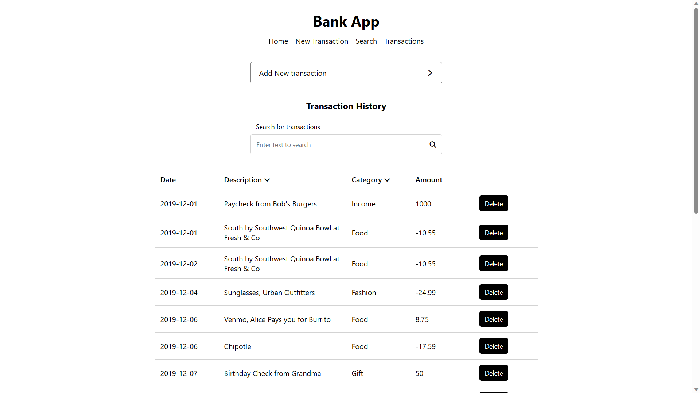
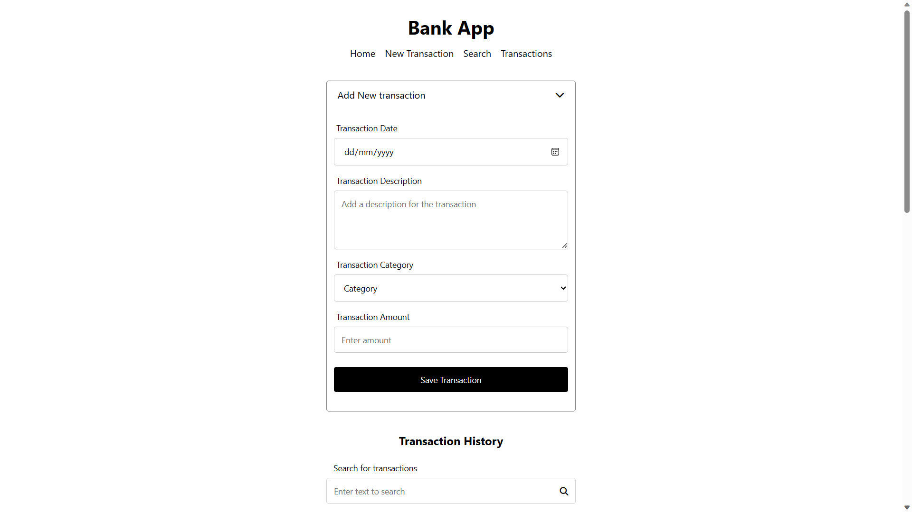
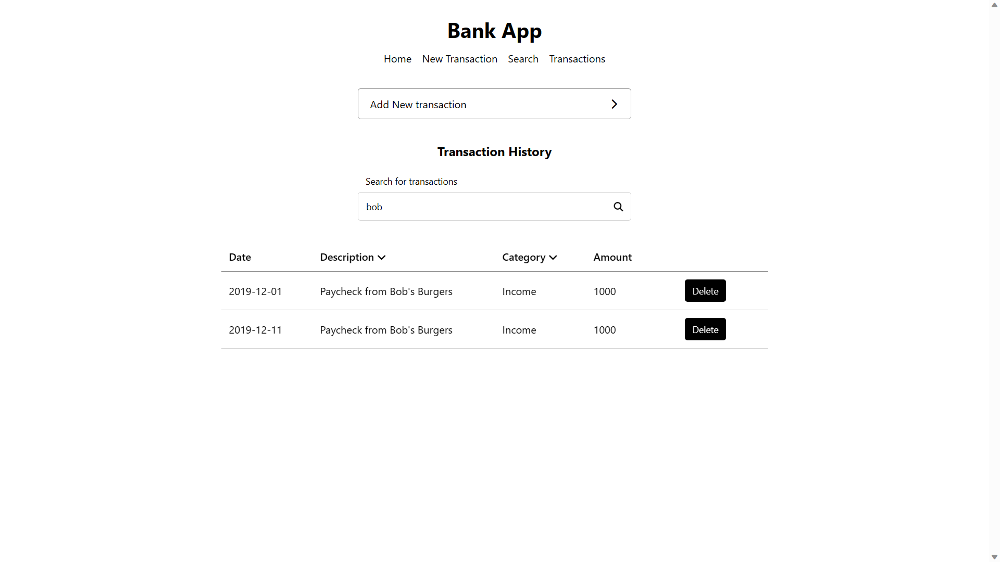

# PHASE 2 - WEEK 1 - CODE CHALLENGE
 

# Bank App
A mini web app to practice on components, props, state, events and data fetching in React 

The website:
- Shows a table of all transactions.
- Allows a user to fill out and submit the form to add a new transaction. 
- Filters transactions when user types into the search bar. Only transactions with a description matching the search term is shown in the transactions table.
- Allows the user to sort transactions alphabetically by category or description.
- Allows the user to delete a transaction which will remove it from the table

# Setup Requirements

- Visual Studio Code, see [here](https://code.visualstudio.com/)
- Windows Subsystem for Linux (WSL), details [here](https://learn.microsoft.com/en-us/windows/wsl/install)
- Git and Github
- Node.js (includes npm), see [here](https://nodejs.org/en)
- json-server, see [here](https://www.npmjs.com/package/json-server)
- Any Modern Web Browser

# Installation

- Clone/Download the code from GitHub repository
- Navigate to the project directory
- Run npm install
- Run npm start to run the app on the browser
- The app should run on any modern web browser with JavaScript enabled

# Technologies

Technologies used in the project include:

- JavaScript
- JSX
- HTML
- CSS
- JSON
- json-server mock API using included db.json

# Screenshots

Bank App, view, add, sort, filter and delete transactions

Add new transaction

Filter(search) for transaction

# Author

[Eugene Aduogo](https://github.com/eugenemrg)

# License

Bank App. A mini web app to practice on components, props, state, events and data fetching in React 
Copyright (C) 2023  [Eugene Aduogo](https://github.com/eugenemrg)

Licensed under GNUv3. See [license](/LICENSE)

This program is free software: you can redistribute it and/or modify
it under the terms of the GNU General Public License as published by
the Free Software Foundation, either version 3 of the License, or
(at your option) any later version.

This program is distributed in the hope that it will be useful,
but WITHOUT ANY WARRANTY; without even the implied warranty of
MERCHANTABILITY or FITNESS FOR A PARTICULAR PURPOSE.  See the
GNU General Public License for more details.

You should have received a copy of the GNU General Public License
along with this program.  If not, see <https://www.gnu.org/licenses/>.
